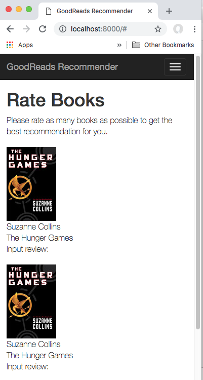

# Goodreads recommendation app & Django tutorial

## TOC
-[Goal & Prep](#prep) 
-[Basic Bootstrap UI](#bootstrap) 
-[Still to-do](#to-do) 

## <a name="prep">Goal & Prep</a>
My goal was to build a app that does Goodreads book recommendations first based on [this](https://www.kaggle.com/zygmunt/goodbooks-10k/home) nicely put together 10k book list.

To prepare I browsed a few tutorials, none were as helpful as building things mostly from scratch. I did learn that the Django framework best practice is to use a series of apps inside what they call a project (I think of like a site right now). [This](https://medium.com/@siddharthshringi/how-i-made-my-first-django-app-4ede65c9b17f) article from another coder learning Django talks about his experience with two test apps and then tries to help people get started.

He creates a site with: 
```python
django-admin startproject mysite .
```

From the [documentation](https://docs.djangoproject.com/en/2.1/ref/django-admin/) they claim "django-admin is Django’s command-line utility for administrative tasks."

The startproject method creates a project directory structure.

Then he suggests to build an app skeleton inside that folder with 

```python
python manage.py startapp app-name
```

In a quick look I don't see exactly what that does but it seems to create a different skeleton, including a models.py file and views.py file. You could probably read more to see why, but all of the tutorials I saw used this starting command.

I did read that the apps are supposed to be focused utilities that can be tied together into a larger project or site. I don't really think I want to focus on that for my demo project so will just do most things in one app I've called simple.

FYI, I ended up playing with the URL building system in Django and following the tutorials to create a template that took in an html page for my simple book recommendation app plan.

## <a name="bootstrap">Basic Bootstrap UI</a>

Next I installed bootstrap 3 as it was the first google search result (despite later seeing bootstrap 4) to make a pretty basic UI. The relevant command was:

```python
$ pip install django-bootstrap3
```

I found this in [this](https://django-bootstrap3.readthedocs.io/en/latest/installation.html) django-bootstrap3 documentation site.

I may have went a little bit hacky as the original template file I took into the code included the css in some folder I couldn't access so I just went to the http link:
```
<link href="https://maxcdn.bootstrapcdn.com/bootstrap/3.3.7/css/bootstrap.min.css" rel="stylesheet">
```

I had some fun here applying earlier knowledge and creating header and footer templates using  so I could have a cleaner main simple.html template to work with. 



One part that confused me is how the book_dict object I put in is pulled into the template. I kept trying to do {{book_dict.author}} but eventually discovered all I needed was {{author}}, the view seemed to already open up the book_dict.

## <a name="to-do">Still to do</a>

So far I've got hardcoded books showing up on a boostrap app with Django. I've separately also played with some data & modeling of it. Next steps include:
- Finalize the recommendation model and train it 
- Try hardcoded recommendations
- Get fit model into database
- Update the UI to accept inputs & output recommendations.
- Celebrate for doing a fun project where I got to learn a ton and overcome many challenges!
:fireworks::smiley::fireworks: