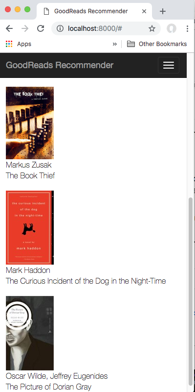

# Goodreads recommendation app & Django tutorial

## TOC
-[Goal & Prep](#prep).  
-[Basic Bootstrap UI](#bootstrap).  
-[Basic incorporate recommender into app (v0)](#v0). 
-[Still to-do](#to-do). 


## <a name="prep">Goal & Prep</a>
My goal was to build a app that does Goodreads book recommendations first based on [this](https://www.kaggle.com/zygmunt/goodbooks-10k/home) nicely put together 10k book list.

To prepare I browsed a few tutorials, none were as helpful as building things mostly from scratch. I did learn that the Django framework best practice is to use a series of apps inside what they call a project (I think of like a site right now). [This](https://medium.com/@siddharthshringi/how-i-made-my-first-django-app-4ede65c9b17f) article from another coder learning Django talks about his experience with two test apps and then tries to help people get started.

He creates a site with: 
```python
django-admin startproject mysite .
```

From the [documentation](https://docs.djangoproject.com/en/2.1/ref/django-admin/) they claim "django-admin is Django’s command-line utility for administrative tasks."

The startproject method creates a project directory structure.

Then he suggests to build an app skeleton inside that folder with 

```python
python manage.py startapp app-name
```

In a quick look I don't see exactly what that does but it seems to create a different skeleton, including a models.py file and views.py file. You could probably read more to see why, but all of the tutorials I saw used this starting command.

I did read that the apps are supposed to be focused utilities that can be tied together into a larger project or site. I don't really think I want to focus on that for my demo project so will just do most things in one app I've called simple.

FYI, I ended up playing with the URL building system in Django and following the tutorials to create a template that took in an html page for my simple book recommendation app plan.

## <a name="bootstrap">Basic Bootstrap UI</a>

Next I installed bootstrap 3 as it was the first google search result (despite later seeing bootstrap 4) to make a pretty basic UI. The relevant command was:

```python
$ pip install django-bootstrap3
```

I found this in [this](https://django-bootstrap3.readthedocs.io/en/latest/installation.html) django-bootstrap3 documentation site.

I may have went a little bit hacky as the original template file I took into the code included the css in some folder I couldn't access so I just went to the http link:
```
<link href="https://maxcdn.bootstrapcdn.com/bootstrap/3.3.7/css/bootstrap.min.css" rel="stylesheet">
```

I had some fun here applying earlier knowledge and creating header and footer templates using  so I could have a cleaner main simple.html template to work with. 


One part that confused me is how the book_dict object I put in is pulled into the template. I kept trying to do {{book_dict.author}} but eventually discovered all I needed was {{author}}, the view seemed to already open up the book_dict.

## <a name="v0">Basic recommender incorporated (v0)</a>

I've now gone ahead and incorporated the recommender into my app. This had a few oddities.  

First is that for whatever reason my conda environment can run jupyter notebooks that have numpy, pandas, sci-kit learn etc installed even if those packages aren't installed in the environment. I need to further investigate how Jupyter works and it seems it is installed at root in my computer. Not sure if that'll ever be an issue. I installed the packages in my env with a series of conda install -xyz commands. That resolved that issue.  

Then I went through a series of mini-steps pulling in my code in a very basic way: without a database. I put in the necessary csv files from my Jupyter Notebook and then imported those in the view tab. This is probably not ideal as I think it means any view will at least have to load scipy and other somewhat chunky things.  

One thing I didn't fully understand is how Contexts work in Django that pass info from the view to the template. I was worried my list in a dictionary wrapper wouldn't work as some examples may be dicts in dicts? In any case, it worked fine so I could just further inspect that.

To make this work I created a few functions in view.py to make my code a tiny bit cleaner (still lots of room for improvement). I then used some code from [this](https://towardsdatascience.com/collaborative-filtering-based-recommendation-systems-exemplified-ecbffe1c20b1) great article on building collaborative filtering systems. She uses a Cosine and Pearson similarity metric in the code (via the NearestNeighbors model) and they both performed around the same so I just chose the one that was already loaded last. As I now re-read her article she says Cosine is good when data is sparse like this dataset and Pearson is good when there is different rating scales/user bias. There isn't different rating scales and I haven't looked at the bias in the ratings. I could inspect that.  

Here's the function that finds similar users:  
```python
def findksimilarusers(user_id, ratings, metric, k):
    similarities=[]
    indices=[]
    model_knn = NearestNeighbors(metric = metric, algorithm = 'brute') 
    model_knn.fit(ratings)

    distances, indices = model_knn.kneighbors(ratings.iloc[user_id-1, :].values.reshape(1, -1), n_neighbors = k+1)
    similarities = 1-distances.flatten()
    for i in range(0, len(indices.flatten())):
        if indices.flatten()[i]+1 == user_id:
            continue;
            
    return similarities,indices
```
See what this looks like in this screenshot:



As I thought about what to do next I also investigated the GoodReads API to see about getting users' ratings data. I decided not to pursue this due to their API status (it is complained about on their own site) and the web scraping didn't seem straightforward when I tried for a little time. May come back to that idea but scraping it from my to-do list needs.


## <a name="deploy v0">Deploy v0</a>

I decided to deploy my v0 app before going ahead with anything else. I went with Heroku as it seemed simple. In my first deploy it failed and I didn't quite get why the errors led me to articles online about needing profiles or pipfiles perhaps. I ended up getting this Python demo app from Heroku, deploying it as it was very quickly following their instructions and then moving my app over to theirs since it is very basic. That deployed after I fixed the requirements.txt file to have '==' instead of '=' to set package versions. That was pretty cool. :fireworks::smiley::fireworks:  

I'm about to now see if fixing the requirements.txt file in this codebase and moving it one directory lower (to root) will help.

## <a name="to-do">Still to do</a>

So far I've got a Pearsons similarity recommender where I hardcode which user I recomend books for in my view and a fairly slow app. I've decided to pause here a

Next steps could include:
- Inspect bias in ratings data and decide if Cosine would be better.  
- Let the user input an id and give a little context on why to choose which id in the dataset or let the user input books they've read and use their new user id (this may require more changes). (not interested in trying authentication for now - see more above.)
- Improve performance & use a database. 
- Deploy app. This also will require me to test if the requirements.txt file I set up works as I manually installed those things with conda install.  
- Celebrate for doing a fun project where I got to learn a ton and overcome many challenges!
:fireworks::smiley::fireworks: